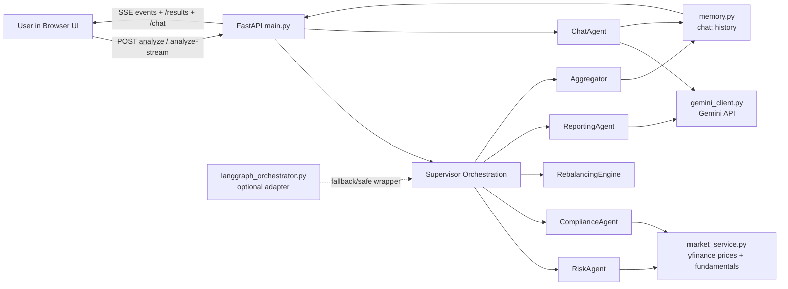
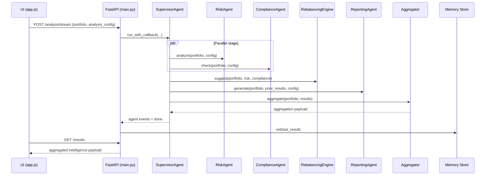

# AI Portfolio Intelligence Dashboard: One-Page Architecture

## Purpose
This service analyzes a user portfolio and returns explainable intelligence across risk, compliance, rebalancing, and AI commentary.

## System At A Glance
- API framework: FastAPI
- UI: Single-page app in ui/
- Market data source: yfinance wrapper
- AI narrative source: Gemini (with deterministic fallback)
- Orchestration: Supervisor pipeline (LangGraph adapter is optional fallback wrapper)
- State: in-memory latest-result store

## Core Agents And Roles
1. SupervisorAgent
- Orchestrates execution and emits streaming stage events.

2. RiskAgent
- Computes portfolio and per-asset risk/performance analytics.
- Outputs volatility, Sharpe, VaR, drawdown, benchmark alpha/beta, rolling metrics, correlation matrix, and risk contribution.

3. ComplianceAgent
- Applies profile-based policy rules and emits violations with severity.

4. RebalancingEngine
- Suggests weight changes to reduce concentration and improve risk mix.

5. ReportingAgent
- Builds structured report from computed analytics.
- Uses Gemini when available; falls back to deterministic report if needed.

6. Aggregator
- Merges all outputs into the single payload consumed by UI and results endpoint.

7. ChatAgent
- Answers finance/investment/portfolio questions using Gemini with deterministic fallback.
- Grounds responses on latest aggregated analysis and short-lived chat session history.

## Component Diagram

## Runtime Sequence

## AI Integration
- Primary AI provider: Google Gemini via google-genai SDK
- Integration module: gemini_client.py
- Consuming component: ReportingAgent
- AI responsibilities:
    - Generate structured narrative output (summary, insights, risks, opportunities, recommendations)
    - Return dual-language style output support (advanced and simple wording)
- Reliability controls:
    - Deterministic fallback report when API is unavailable, malformed, or low quality
    - Diagnostic endpoint: GET /debug/gemini

## Third-Party Tools And Integrations
- FastAPI: HTTP API server and SSE streaming transport
- Pydantic: request and response schema validation
- yfinance: market prices and fundamentals retrieval
- pandas / numpy: time-series analytics, matrix statistics, and risk math
- google-genai: Gemini model access for reporting intelligence
- LangGraph (optional): orchestration adapter compatibility layer
- Tailwind CSS: frontend utility-first styling
- Chart.js: dashboard visualizations
- Lucide: UI icon system

## Component Integration Matrix
| Component | Internal Responsibility | AI Integration | Third-Party Integrations |
|---|---|---|---|
| UI (ui/index.html, ui/app.js) | Input capture, rendering charts/cards, streaming status updates | Consumes AI report produced by backend ReportingAgent | Tailwind CSS, Chart.js, Lucide, browser fetch/SSE APIs |
| API Layer (main.py) | Route handling, validation wiring, static UI serving, SSE event streaming | Exposes AI diagnostics and returns AI-enriched payloads | FastAPI, Starlette responses/static files, asyncio |
| Schema Layer (schemas.py) | Request contract and config validation | Ensures AI mode flags and config shape are valid before execution | Pydantic |
| SupervisorAgent | Pipeline orchestration and stage sequencing | Coordinates when AI reporting can run after analytics context exists | concurrent.futures ThreadPoolExecutor |
| RiskAgent | Portfolio analytics and risk intelligence generation | Supplies data-grounded context consumed by AI report generation | pandas, numpy, market_service (yfinance-backed) |
| ComplianceAgent | Rule checks, violations, profile-based policy enforcement | Supplies compliance context to ReportingAgent prompt and recommendations | market_service sector lookups (yfinance-backed) |
| RebalancingEngine | Heuristic rebalance suggestions and risk-impact estimate | Provides recommendation context that AI can explain in narrative form | numpy (via risk covariance data) |
| ReportingAgent | Structured insight generation and normalization | Direct Gemini invocation, parse/normalize output, fallback narrative generation | google-genai (through gemini_client), json utilities |
| Aggregator | Consolidates final payload for UI/API | Packages AI report and deterministic metadata with analytics outputs | Standard library only |
| Market Service (market_service.py) | Data acquisition + short-lived caching | Indirectly supports AI by supplying factual market context | yfinance, pandas, threading |
| Gemini Client (gemini_client.py) | Model request abstraction, diagnostics, fallback model behavior | Core AI gateway for ReportingAgent | google-genai, environment configuration |
| LangGraph Adapter (langgraph_orchestrator.py) | Optional orchestration compatibility wrapper | No direct model inference; orchestration-level integration point | langgraph (optional import) |
| Memory Store (memory.py) | Stores latest aggregated result for retrieval | Persists AI-enriched output with other analytics | Standard library synchronization primitives |

## Integration By Flow Stage
1. Input stage:
- UI -> FastAPI uses Pydantic validation.

2. Data and analytics stage:
- RiskAgent and ComplianceAgent call market_service, which uses yfinance.
- pandas/numpy perform time-series and matrix computations.

3. Recommendation stage:
- RebalancingEngine transforms risk/compliance outputs into suggested weight adjustments.

4. AI narrative stage:
- ReportingAgent builds prompt from prior results and calls Gemini via gemini_client.
- On failure, deterministic fallback keeps output contract stable.

5. AI chat stage:
- ChatAgent consumes latest aggregated result plus short-term chat context.
- Gemini returns grounded answer with confidence/citations; deterministic fallback keeps response stable.

6. Aggregation and delivery stage:
- Aggregator merges risk/compliance/rebalancing/report.
- FastAPI streams progress via SSE and serves final payload via /results.

## API Surface
- GET /
- POST /analyze
- POST /analyze/stream (SSE)
- GET /results
- GET /debug/gemini
- POST /chat

## Request Contract
- portfolio: array of ticker + weight
- analysis_config:
  - benchmark
  - risk_profile (conservative | moderate | aggressive)
  - mode (advanced | simple)
  - stress_test
  - compliance_rules overrides

## Output Contract (Aggregated)
- risk
- benchmark
- performance
- risk_insights
- correlation_matrix
- risk_contribution
- compliance
- rebalancing
- report / insights
- meta

## Design Notes
- Risk and compliance execute in parallel for lower latency.
- Reporting runs after analytics and policy checks so language output is data-grounded.
- Frontend uses SSE stage events for real-time pipeline status.
- Latest result is in-memory and process-local (not durable storage).
