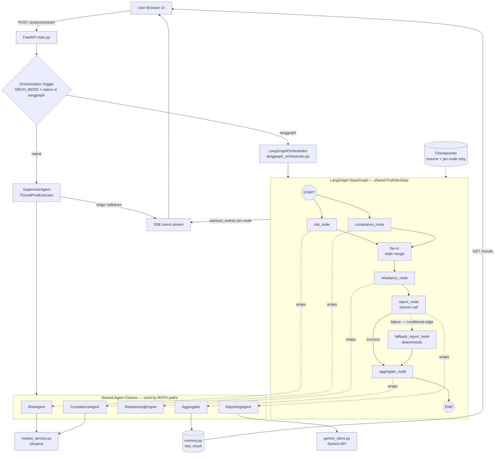
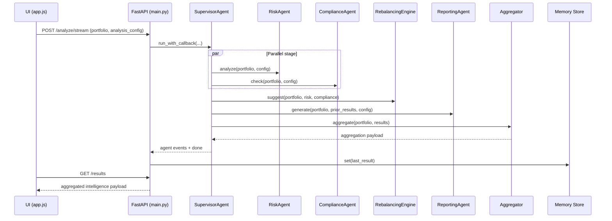
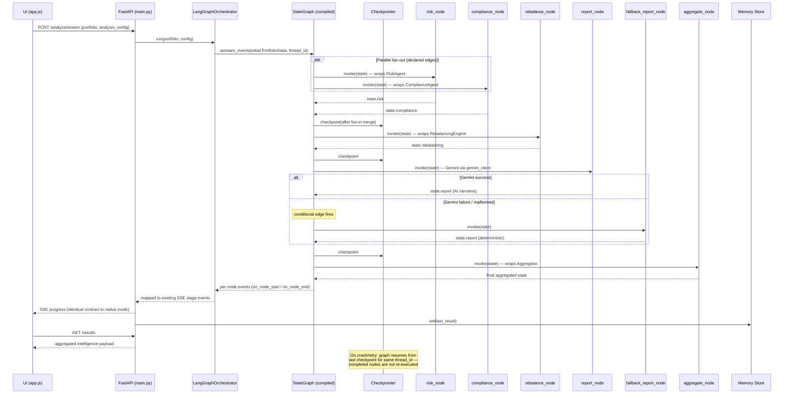

# AI Portfolio Intelligence Dashboard: One-Page Architecture

## Purpose
This service analyzes a user portfolio and returns explainable intelligence across risk, compliance, rebalancing, and AI commentary.

## System At A Glance
- API framework: FastAPI
- UI: Single-page app in ui/
- Market data source: yfinance wrapper
- AI narrative source: Gemini (with deterministic fallback)
- Orchestration: **Pluggable** — native Supervisor pipeline (default) or LangGraph StateGraph, selected by runtime toggle (`ORCH_MODE`)
- State: in-memory latest-result store

## Core Agents And Roles
1. **SupervisorAgent** — Orchestrates execution (native mode) and emits streaming stage events.
2. **RiskAgent** — Computes portfolio and per-asset risk/performance analytics: volatility, Sharpe, VaR, drawdown, benchmark alpha/beta, rolling metrics, correlation matrix, risk contribution.
3. **ComplianceAgent** — Applies profile-based policy rules and emits violations with severity.
4. **RebalancingEngine** — Suggests weight changes to reduce concentration and improve risk mix.
5. **ReportingAgent** — Builds structured report from computed analytics; uses Gemini when available, deterministic report otherwise.
6. **Aggregator** — Merges all outputs into the single payload consumed by UI and results endpoint.

## Orchestration Modes

| Aspect | Native (SupervisorAgent) | LangGraph (LangGraphOrchestrator) |
|---|---|---|
| Parallelism | Manual — ThreadPoolExecutor | Declarative — edges from START to risk_node and compliance_node |
| Fallback routing | try/except in ReportingAgent | Conditional edge: report_node → fallback_report_node on failure |
| Progress events | Stage callbacks → SSE | `astream_events()` per-node events → same SSE stream |
| Recovery | None (full re-run) | Checkpointer — resume mid-pipeline, per-node retry |
| Observability | Log lines | Visualizable execution graph + traced state transitions |
| Selection | `ORCH_MODE=native` (default) | `ORCH_MODE=langgraph` |

Both modes wrap the **same agent classes** — the UI, SSE contract, and output payload are identical. Same pipeline, two orchestrators, one flag.

## Component Diagram

## Runtime Sequence — Native Mode

## Runtime Sequence — LangGraph Mode

## LangGraph Integration Details
- **State schema:** `PortfolioState` (TypedDict) — portfolio, config, risk, compliance, rebalancing, report, meta. All nodes read/write this single object.
- **Node mapping:** Each node is a thin wrapper calling the existing agent class — no agent logic is duplicated or moved.
- **Fan-out / fan-in:** Edges `START → risk_node` and `START → compliance_node` run concurrently; LangGraph merges state before `rebalance_node`.
- **Conditional edge:** After `report_node`, a router inspects report validity → `aggregate_node` on success, `fallback_report_node` on failure. The deterministic-fallback guarantee is now encoded in the graph, not hidden in try/except.
- **Event → SSE mapping:** `on_node_start` / `on_node_end` events are translated to the same stage-event names the native supervisor emits, so `app.js` needs zero changes.
- **Checkpointer:** `MemorySaver` (in-process) by default; swappable for SQLite/Postgres saver for durable resume.
- **Safe import:** `langgraph_orchestrator.py` uses optional import — if langgraph is not installed, the toggle silently resolves to native mode.

## AI Integration
- Primary AI provider: Google Gemini via google-genai SDK
- Integration module: gemini_client.py
- Consuming component: ReportingAgent (native) / report_node (LangGraph)
- AI responsibilities:
    - Generate structured narrative output (summary, insights, risks, opportunities, recommendations)
    - Dual-language style output support (advanced and simple wording)
- Reliability controls:
    - Deterministic fallback report when API is unavailable, malformed, or low quality — enforced via try/except (native) or conditional edge (LangGraph)
    - Diagnostic endpoint: GET /debug/gemini

## Third-Party Tools And Integrations
- FastAPI: HTTP API server and SSE streaming transport
- Pydantic: request and response schema validation
- yfinance: market prices and fundamentals retrieval
- pandas / numpy: time-series analytics, matrix statistics, and risk math
- google-genai: Gemini model access for reporting intelligence
- LangGraph (optional): alternate declarative orchestrator — StateGraph, conditional edges, checkpointing, per-node event streaming
- Tailwind CSS: frontend utility-first styling
- Chart.js: dashboard visualizations
- Lucide: UI icon system

## Component Integration Matrix
| Component | Internal Responsibility | AI Integration | Third-Party Integrations |
|---|---|---|---|
| UI (ui/index.html, ui/app.js) | Input capture, rendering charts/cards, streaming status updates | Consumes AI report produced by backend | Tailwind CSS, Chart.js, Lucide |
| API Layer (main.py) | Route handling, validation wiring, static UI serving, SSE streaming, orchestrator selection | Exposes AI diagnostics and returns AI-enriched payloads | FastAPI, Starlette |
| Schema Layer (schemas.py) | Request contract and config validation | Validates AI mode flags and config shape before execution | Pydantic |
| SupervisorAgent | Native pipeline orchestration and stage sequencing | Coordinates when AI reporting runs after analytics context exists | ThreadPoolExecutor |
| LangGraph Orchestrator (langgraph_orchestrator.py) | Alternate declarative orchestration: StateGraph build, node wrapping, event→SSE mapping, checkpointing | Routes AI reporting via conditional edge with deterministic fallback node | langgraph (optional import) |
| RiskAgent | Portfolio analytics and risk intelligence | Supplies data-grounded context for AI report | pandas, numpy, market_service |
| ComplianceAgent | Rule checks, violations, policy enforcement | Supplies compliance context to report prompt | market_service sector lookups |
| RebalancingEngine | Heuristic rebalance suggestions and risk-impact estimate | Provides recommendation context for AI narrative | numpy |
| ReportingAgent | Structured insight generation and normalization | Direct Gemini invocation, parse/normalize, fallback narrative | google-genai (via gemini_client) |
| Aggregator | Consolidates final payload for UI/API | Packages AI report with analytics outputs | Standard library |
| Market Service (market_service.py) | Data acquisition + short-lived caching | Supplies factual market context grounding the AI | yfinance, pandas, threading |
| Gemini Client (gemini_client.py) | Model request abstraction, diagnostics, fallback model behavior | Core AI gateway | google-genai, env configuration |
| Memory Store (memory.py) | Stores latest aggregated result | Persists AI-enriched output | Standard library sync primitives |

## Integration By Flow Stage
1. **Input:** UI → FastAPI with Pydantic validation; API selects orchestrator via `ORCH_MODE`.
2. **Data + analytics:** RiskAgent and ComplianceAgent (or their graph nodes) call market_service (yfinance); pandas/numpy compute time-series and matrix math — in parallel in both modes.
3. **Recommendation:** RebalancingEngine transforms risk/compliance outputs into suggested weight adjustments.
4. **AI narrative:** ReportingAgent builds a prompt from prior results and calls Gemini; deterministic fallback keeps the output contract stable (try/except natively, conditional edge in LangGraph).
5. **Aggregation + delivery:** Aggregator merges all results; FastAPI streams progress via SSE (identical event contract in both modes) and serves the final payload via /results.

## API Surface
- GET /
- POST /analyze
- POST /analyze/stream (SSE)
- GET /results
- GET /debug/gemini

## Request Contract
- portfolio: array of ticker + weight
- analysis_config:
  - benchmark
  - risk_profile (conservative | moderate | aggressive)
  - mode (advanced | simple)
  - stress_test
  - compliance_rules overrides
  - orchestrator (native | langgraph) — optional override of `ORCH_MODE`

## Output Contract (Aggregated)
- risk
- benchmark
- performance
- risk_insights
- correlation_matrix
- risk_contribution
- compliance
- rebalancing
- report / insights
- meta (includes orchestrator used)

## Design Notes
- Risk and compliance execute in parallel for lower latency — in both orchestration modes.
- Reporting runs after analytics and policy checks so language output is data-grounded.
- Frontend uses SSE stage events for real-time pipeline status; the event contract is orchestrator-agnostic.
- LangGraph adds checkpoint/resume, per-node retries, and a visualizable graph without touching agent logic or the UI.
- Latest result is in-memory and process-local (not durable storage).
